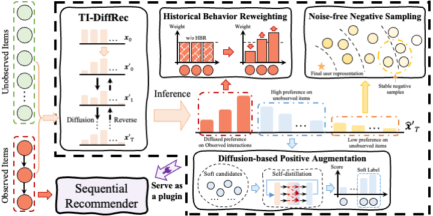

# PDRec
The source code is for the paper: [Plug-In Diffusion Model for Sequential Recommendation](https://arxiv.org/pdf/2401.02913.pdf) accepted in AAAI 2024 by Haokai Ma, Ruobing Xie, Lei Meng, Xin Chen, Xu Zhang, Leyu Lin and Zhanhui Kang.

## Overview
This paper presents a novel Plug-In Diffusion Model for Recommendation (PDRec) framework, which employs the diffusion model as a flexible plugin to jointly take full advantage of the diffusion-generating user preferences on all items. Specifically, PDRec first infers the users' dynamic preferences on all items via a time-interval diffusion model and proposes a Historical Behavior Reweighting (HBR) mechanism to identify the high-quality behaviors and suppress noisy behaviors. In addition to the observed items, PDRec proposes a Diffusion-based Positive Augmentation (DPA) strategy to leverage the top-ranked unobserved items as the potential positive samples, bringing in informative and diverse soft signals to alleviate data sparsity. To alleviate the false negative sampling issue, PDRec employs Noise-free Negative Sampling (NNS) to select stable negative samples for ensuring effective model optimization.

## Dependencies
- Python 3.8.10
- PyTorch 1.12.0+cu102
- pytorch-lightning==1.6.5
- Torchvision==0.8.2
- Pandas==1.3.5
- Scipy==1.7.3

## Implementation of PDRec
We use the Toy dataset from the [Amazon](https://nijianmo.github.io/amazon/index.html) platform and the Book dataset from the [Douban](https://github.com/RUCAIBox/RecBole-CDR) platform.
PDRec (GRU4Rec) on Toy:
```
CUDA_VISIBLE_DEVICES=0 python PDRec.py --dataset=amazon_toy --lr 0.005 --temperature 5 --scale_weight 2.0 --scale_max 3.0 --rank_weight 0.1 --candidate_min_percentage_user 50 --top_candidate_coarse_num 50 --top_candidate_fine_num 5 --top_candidate_weight 0.3 --base_model GRU4Rec
```
PDRec (SASRec) on Toy:
```
CUDA_VISIBLE_DEVICES=1 python PDRec.py --dataset=amazon_toy --lr 0.005 --temperature 5 --scale_weight 4.0 --scale_max 1.0 --rank_weight 0.1 --candidate_min_percentage_user 90 --top_candidate_coarse_num 50 --top_candidate_fine_num 5 --top_candidate_weight 0.05 --base_model SASRec
```
PDRec (GRU4Rec) on Book:
```
CUDA_VISIBLE_DEVICES=2 python PDRec.py --dataset=douban_book --lr 0.01 --temperature 10 --scale_weight 4.0 --scale_max 3.0 --rank_weight 0.3 --candidate_min_percentage_user 80 --top_candidate_coarse_num 100 --top_candidate_fine_num 1 --top_candidate_weight 0.01 --base_model GRU4Rec
```
PDRec (SASRec) on Book:
```
CUDA_VISIBLE_DEVICES=3 python PDRec.py --dataset=douban_book --lr 0.001 --temperature 10 --scale_weight 4.0 --scale_max 3.0 --rank_weight 0.5 --candidate_min_percentage_user 80 --top_candidate_coarse_num 100 --top_candidate_fine_num 1 --top_candidate_weight 0.01 --base_model SASRec
```


## BibTeX
If you find this work useful for your research, please kindly cite PDRec by:
```
@inproceedings{PDRec,
  title={Plug-In Diffusion Model for Sequential Recommendation},
  author={Ma, Haokai and Xie, Ruobing and Meng, Lei and Chen, Xin and Zhang, Xu and Lin, Leyu and Kang, Zhanhui},
  booktitle={Proceedings of the AAAI Conference on Artificial Intelligence},
  year={2024}
}
```

## Acknowledgement
The structure of this code is largely based on [DiffRec](https://github.com/YiyanXu/DiffRec) and [SASRec](https://github.com/pmixer/SASRec.pytorch) and the dataset is collected by [Amazon](https://nijianmo.github.io/amazon/index.html) and [RecBole](https://github.com/RUCAIBox/RecBole-CDR). Thanks for these works.


